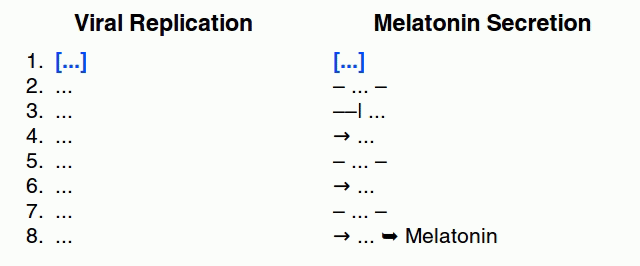
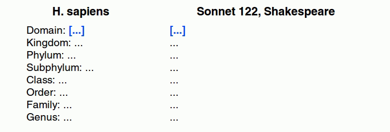
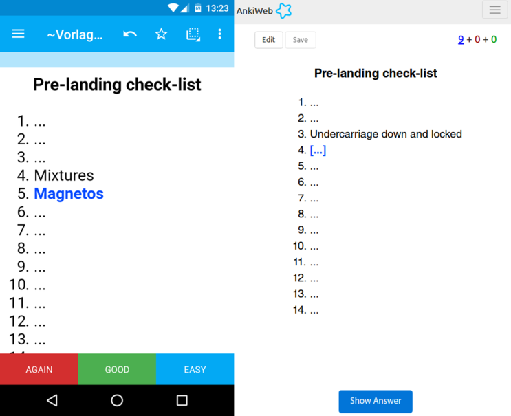

<h2 align="center">Cloze Overlapper for Anki</h2>

 

> List memorization made easy!

This is an add-on for the spaced-repetition flashcard app [Anki](https://apps.ankiweb.net/). It facilitates **memorizing enumerations**, lists, or any other type of sequential information by breaking the sequence up into cards where each item serves as the context cue for the next.

### Table of Contents <!-- omit in toc -->

<!-- MarkdownTOC levels="1,2,3" -->

- [Background](#background)
- [The Add-on](#the-add-on)
- [Installation](#installation)
- [Documentation](#documentation)
- [Building](#building)
- [Contributing](#contributing)
- [License and Credits](#license-and-credits)

<!-- /MarkdownTOC -->

### Background
 
Memorizing lists and enumerations has always been a particularly difficult part of studying flashcards. Good flashcards follow the **minimum information principle**, where each card is kept as short as possible. Sequential information has unfortunately always somewhat eluded that basic principle because it is hard to break down into smaller chunks. Normally you would employ methods like grouping or categorizing to consolidate information, but with each item building upon the next, that does usually not work for sequences or enumerations.

One of the [common recommendations](https://www.supermemo.com/en/articles/20rules#Enumerations) in cases like this has always been to create **overlapping flashcards**, where each card's answer serves as the question prompt for next card in line. For an array of three list items A, B, C you would end up with three cards of the form A → B, B → C, and C → D. What results is chain of overlapping associations between each sequence node that can potentially improve the storage and retrieval strength of the entire sequence.

While this method is generally assumed to be quite effective, following it requires a significant **time investment** up-front that only few students are able or willing to make.

### The Add-on

This is where *Cloze Overlapper* comes in. It takes care of all the arduous steps required to create these flashcards manually and provides you with a dead-simple workflow: You paste in the sequence or list, adjust the cloze generation settings, and let the add-on generate the cards for you. 

More generally speaking, *Cloze Overlaper* provides Anki with a completely novel cloze system that can cover almost every use case you can think of, be it revealing each taxon of a classification system individually, or even gradually building up to an entire poem:

Due to working with the formatting tools that Anki provides itself, the cards generated by this add-on are fully **compatible with all Anki platforms**, smartphone apps included:

### Installation

#### AnkiWeb <!-- omit in toc -->

The easiest way to install Cloze Overlapper is through [AnkiWeb](https://ankiweb.net/shared/info/969733775).

#### Manual installation <!-- omit in toc -->

Please click on the entry corresponding to your Anki version:

**Note: Pre-compiled test builds for Anki 2.1 are now available [on my Patreon](https://www.patreon.com/glutanimate/posts?tag=Cloze%20Overlapper).** These will become public once testing is complete.

<i>Anki 2.1</i>

1. Make sure you have the [latest version](https://apps.ankiweb.net/#download) of Anki 2.1 installed. Earlier releases (e.g. found in various Linux distros) do not support `.ankiaddon` packages.
2. Download the latest `.ankiaddon` package from [my Patreon](https://www.patreon.com/glutanimate/posts?tag=Cloze%20Overlapper)
3. From Anki's main window, head to *Tools* → *Add-ons*
4. Drag-and-drop the `.ankiaddon` package onto the add-ons list
5. Restart Anki

<i>Anki 2.0</i>

1. Go to *Tools* → *Add-ons* → *Open add-ons folder*
2. Find and delete the `Cloze Overlapper.py` file if it already exists.
3. See if you can find a `cloze_overlapper` folder. If so:
    1. If the folder contains a `meta.json` file, copy the file to a safe location. This will allow you to preserve your current settings.
    2. Proceed to delete the `cloze_overlapper` folder
4. Download and extract the latest Anki 2.0 add-on release from [my Patreon](https://www.patreon.com/glutanimate/posts?tag=Cloze%20Overlapper)
5. Move the extracted `Cloze Overlapper.py` and `cloze_overlapper` into the add-ons folder
6. Optional: Place the `meta.json` file back into the directory if you created a copy beforehand.
7. Restart Anki

### Documentation

The use of the add-on is documented in the [Wiki section](https://github.com/Glutanimate/cloze-overlapper/wiki) and a [series of video tutorials on YouTube](https://www.youtube.com/watch?v=QzBoDe3PgAc&list=PL3MozITKTz5Y9owI163AJMYqKwhFrTKcT). More information may also be found in the [AnkiWeb description](docs/description.md).

### Building

With [Anki add-on builder](https://github.com/glutanimate/anki-addon-builder/) installed:

    git clone https://github.com/glutanimate/cloze-overlapper.git
    cd cloze-overlapper
    aab build

For more information on the build process please refer to [`aab`'s documentation](https://github.com/glutanimate/anki-addon-builder/#usage).

### Contributing

Contributions are welcome! Please review the [contribution guidelines](./CONTRIBUTING.md) on how to:

- Report issues
- File pull requests
- Support the project as a non-developer

### License and Credits

*Cloze Overlapper* is *Copyright © 2019 [Aristotelis P.](https://glutanimate.com/) (Glutanimate)*

With code contributions from: [zjosua](https://github.com/zjosua), (Thank you!)

I would like to extend my heartfelt thanks to everyone who has helped with testing, provided suggestions, or contributed in any other way!

I'd also like to thank:

- [Piotr Wozniak](https://www.supermemo.com/english/company/wozniak.htm) for laying the theoretical groundwork for overlapping cloze deletions with his [20 rules of formulating knowledge](https://www.supermemo.com/en/articles/20rules)
- [Soren Bjornstad](https://github.com/sobjornstad) for giving me the inspiration for this add-on with his project [AnkiLPCG](https://github.com/sobjornstad/AnkiLPCG), back when it was still a standalone module

Cloze Overlapper is free and open-source software. The add-on code that runs within Anki is released under the GNU AGPLv3 license, extended by a number of additional terms. For more information please see the [LICENSE](https://github.com/glutanimate/cloze-overlapper/blob/master/LICENSE) file that accompanied this program.

This program is distributed in the hope that it will be useful, but WITHOUT ANY WARRANTY.

----

<b>

The continued development of this add-on is made possible  thanks to my <a href="https://www.patreon.com/glutanimate">Patreon</a> and <a href="https://ko-fi.com/X8X0L4YV">Ko-Fi</a> supporters.
 You guys rock ❤️ !

</b>